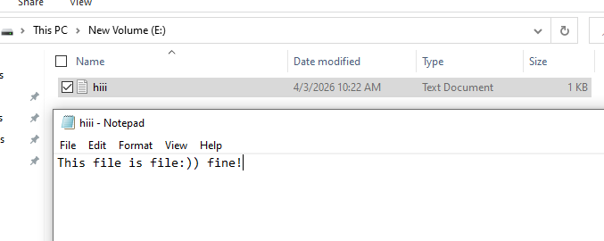

# 1. Khôi phục dữ liệu khi Delete hoặc Shift Delete

# Manual (FTK)

## Thực hành

Chuẩn bị 1 file .txt có nội dung như trên

### 1. Thực hiện khôi phục khi Delete

Khi một tập tin bị xóa mềm (chuyển vào Thùng rác), Windows sẽ đổi tên nó và tạo ra một cặp file đi liền với nhau, sử dụng chung một chuỗi 6 ký tự ngẫu nhiên

#### B1: Vào FTK để Add Evidence Item

#### B2: Chọn Logical Drive

#### B3: Chọn ổ E vừa mới xóa file .txt sau đó Finish

#### B4: Nhìn vào góc trên tay trái Evidence Tree, hãy mở ổ E ra và chọn [root]

#### B5: Chọn Mode HEX

#### B6: Nhấp vào $MFT

#### B7: Dùng Ctrl + F hoặc click chuột phải vào hex bên dưới và chọn Find để tìm kiến

#### B8: Tìm kiếm tên File .txt vừa xóa

#### B9: Xác định tên file bị xóa

#### B10: Vào thùng rác xem

- **File `$R...` (`$RQBVF2A.txt`):** Chữ R đại diện cho Raw/Resource. Đây chính là file chứa **nội dung dữ liệu thực sự** của file đã bị xóa.
- **File `$I...` (`$IQBVF2A.txt`):** Chữ I đại diện cho Info/Index. Đây là **file metadata** được hệ thống tự động sinh ra. Nó có nhiệm vụ lưu trữ kích thước file gốc, thời gian file bị xóa (Deletion Time), và quan trọng nhất là **đường dẫn gốc của file**.

#### B11: Thực hiện khôi phục dữ liệu, chọn Export File …

#### B12: Lưu vào Folder bạn muốn

#### B13: Kiểm tra nội dung file

### 2. Thực hiện khôi phục khi Shift Delete

**Resident** (dữ liệu nằm ngay trong MFT, không bị đẩy ra ngoài) là file dưới 1024 byte

**Non-Resident** (dữ liệu quá lớn phải lưu ở các cluster khác trên ổ cứng) trên 1024 byte, sẽ có địa chỉ nằm trong MFT.

#### Khôi phục dữ liệu đối với **Resident**

#### B1: Chuẩn bị 1 Ổ cứng E đã full format để tiện cho việc khôi phục dữ liệu, không dính dáng đến các dữ liệu cũ. Và chuẩn bị 1 file .txt không tới 1Kb.

#### B2: Tiến hành Shift Delete

#### B3: Vào FTK chọn Add Evidence Item…

#### B4: Select Source chọn Logical Drive

#### B5: Select Drive chọn ổ E vừa Shift Delete file txt sau đó Finish

#### B6: Chọn Mode Hex để tiện xem các dữ liệu Dec

#### B7: Thực hiện nhấp vào [root] và nhấp vào $MFT

#### B8: Nhấn tổ hợp phím Shift F để tìm kiếm file vừa xóa

#### B9: Phân tích

1. **0x10 đầu tiên** 

Có 96 value dựa trên 60 00 = 96 Value 

Từ cái 0x10 đầu này ta có thể xác định ngày tạo, ngày chỉnh sửa cuối, và ngày truy cập cuối theo quy tắc **C-M-E-A** (Creation, Modification, Entry Modified, Access).

Ngày tạo <99 DA 02 03 30 C3 DC 01>, 4/03/2026 vào lúc 1:06:29 PM

Ngày chỉnh sửa <AF EE 86 22 30 C3 DC 01 >, 4/3/2026 vào lúc 1:07:21 PM

Ngày cập nhật MFT <AF EE 86 22 30 C3 DC 01>, 4/3/2026 vào lúc 1:07:21 PM

Lần truy cập cuối <AF EE 86 22 30 C3 DC 01>, 4/3/2026 vào lúc 1:07:21 PM

1. **0x30 tiếp theo xác định tên của File**

đoạn 80 00 là value = 128 nên bôi đen đúng 128 value

1. **0x40 kế đến** 

Ví dụ dễ hiểu về 0x40 là Object ID

1. **0x80 là data của file** 

40 00 có 64 value nên bôi đen hết 64 value tính từ 80 00

#### B10: Thực hiện khôi phục file, chuột phải vào phần dữ liệu của 0x80 vừa bôi đen và chọn Save Selection

#### Khôi phục dữ liệu đối với Non-**Resident**

Non-**Resident** dữ liệu trong file trên 1024byte

#### B1: Chuẩn bị ổ E đã full format và 1 file .txt trên 1KB

#### B2: Thực hiện Shift Delete

#### B3: Vào FTK chọn Add Evidence Item…

#### B4: Chọn Logical Drive

#### B5: Chọn ổ E vừa mới xóa file .txt sau đó Finish

#### B6: Nhìn vào góc trên tay trái Evidence Tree, hãy mở ổ E ra và chọn [root]

#### B7: Chọn Mode HEX

#### B8: Nhấp vào $MFT

#### B9: Dùng Ctrl + F hoặc click chuột phải vào hex bên dưới và chọn Find để tìm kiến

#### B10: Tìm kiếm tên File .txt vừa xóa

#### B11: Xác định tên file bị xóa

B12: Tính toán địa chỉ gốc của File

1. 0x80 
    
    48 00 có 72 value trong đó sau 48 00 00 00 là 01 00 
    
    00 00 nghĩa là dữ liệu là **Resident** (nằm ngay trong MFT)
    
    01 00 nghĩa là dữ liệu là **Non-Resident** (bị đẩy ra ngoài cluster)
    
    → file hiện tại vượt quá 1024 nên data được lưu ngoài cluster
    
2. Nhìn vào dòng cuối <21 4C 88 05>, tại sao lại là dòng Hex này?
    
    Cuối dã 0x80 thường là lưu size và địa chỉ cluser 
    
    21 tách ra làm 2 phần là 2 và 1
    
    1 bên phải là size
    
    2 bên trái là Offset (vị trí)
    
    
    

Giờ ta đã biết Size của file là 311,296 byte nghĩa là khoảng 304 KB

Và địa chỉ cụ thể là 5,799,936 byte

B13: Tìm dữ liệu từ địa chỉ đã tìm kiếm, ta thực hiện nhấp chuột vào ổ E và Ctrl + G, paste địa chỉ vào 

B14: Nhấp vào điểm bắt đầu data là 74 sau đó click chuột phải chọn Set Selection Length 

Và nhập 311,296 byte vào và nhấp OK

B15: Chuột phải và chọn Save Selection

Và nhấn chọn tên lẫn nơi lưu 

B16: Kiểm tra file

## Tools (GUI)

Disk Drill

EaseUS Data Recovery Wizard Free

Photorec_win (cli)

Recuva Wizard