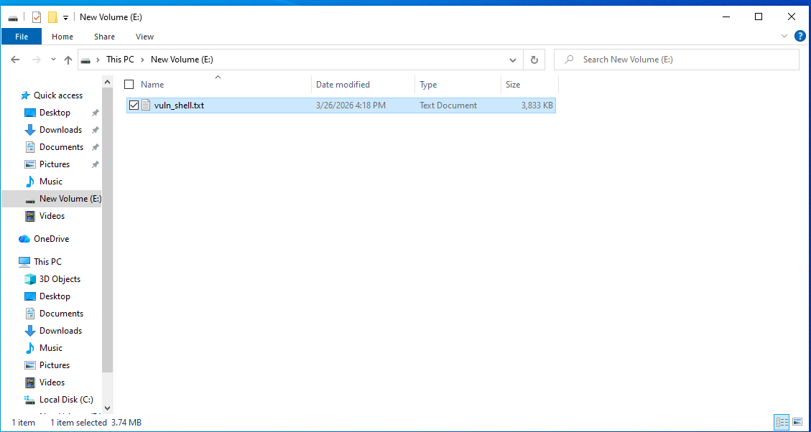

# 2. Khôi phục dữ liệu khi Quick Format

# Manual (FTK)

## Thực hành

Chuẩn bị ổ E đã Full Format để tiện cho việc khôi phục.

Và chuẩn bị 1 file trong ổ E vừa mới Full Format

Thực hiện tìm kiếm địa chỉ và size của File

## Thực hiện khôi phục khi Quick Format

#### B1: Thực hiện Quick Format ổ  E

Nhấp vào Start

#### B2: Vào FTK để Add Evidence Item

#### B3: Chọn Logical Drive

#### B4: Chọn ổ E vừa mới xóa file .txt sau đó Finish

#### B5: Chọn Mode HEX

B6: Chọn E:\ và nhấn tổ hợp phím Ctrl + G để tìm nơi lưu File

#### B7: Nhấp vào điểm bắt đầu data là 2Fsau đó click chuột phải chọn Set Selection Length

#### B8: Chuột phải và chọn Save Selection…

B9: Save lại 

#### B10: Kiểm tra nội dung file vừa lưu

