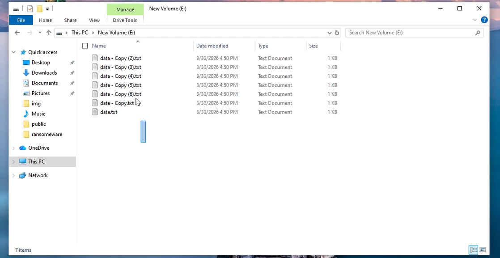

# 3. Khôi phục dữ liệu khi dính ransomeware (rans không có chủ động tắt tính năng shadow)

# Chuẩn bị 1 ổ E có các file

#### B1: Tạo Task trên Task Scheduler

#### B2: Bấm New

#### B3: Qua Phần Action tạo mới

#### B4: Chạy Shadowcopy

#### B5: Kiểm tra

#### B6: Thực hiện chạy ransomeware POC

#### B7: Thực hiện restore lại ổ E

#### B8: Kiểm tra

